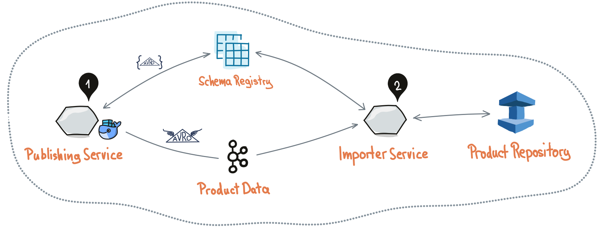
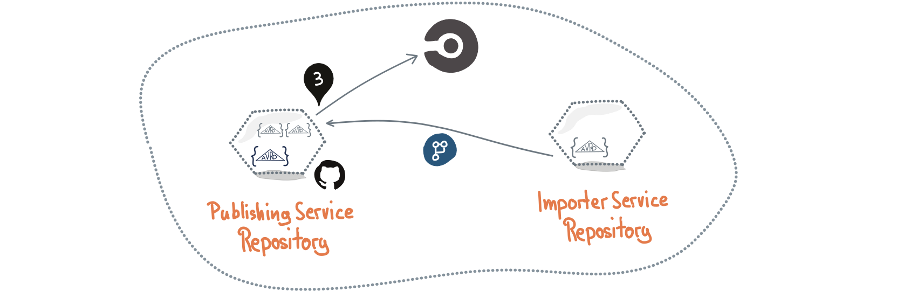
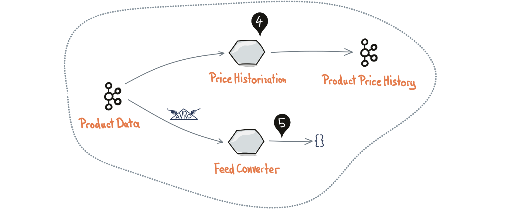

## Streaming Product Data

This is a blueprint for a fast setup of a scalable and resilient data infrastructure based on compacted topics.

**(1)**
The product data **[publishing service](publishing-service/)** produces *Avro* messages into a *compacted topic* [[1]](#avro) [[2]](#compacted-topic).
The Avro schemas of the written data are stored in a *schema registry* for consumers to look it up [[3]](#schema-registry). 

**(2)**
The **[importer service](importer-service/)** of a consuming team stores the products into a (Redis) database for random access.
The writer schema is looked up from the schema registry to **calculate migrations at runtime** to the reader schema of the service.  
That reader schema does not contain all the written fields and therefore reduces the product data to the structure the team needs.

Just a single way is required to implement initial consumption of the data topic as well as processing of subsequent deltas:
Because the compacted topic retains at least the latest value for a key (e.g. stock keeping unit identifier) a consumer starting at the beginning of the topic will eventually reach the end and process further changes.  
Due to Kafkas partitioning CPU bound importers can be easily scaled automatically:
An auto-scaler will scale down the replicas after the initial import of the topic.

**(3)**
Consumer-driven contract tests **ensure compatibility at build time** [[4]](#cdc):
The consuming teams provide their reader schemas as CDC to the publishing service (e.g. by pull requests).
Therefore the publishing team is flexible in changing the writer schema as long as the contracts are satisfied.

**[#5](https://github.com/talentformation/blueprint-streaming-product-data/pull/5)** is an example for a pull request that breaks the CDCs.  
**[#6](https://github.com/talentformation/blueprint-streaming-product-data/pull/6)** is an example for a pull request that removes a non-optional field without breaking the CDCs.  

The schemas are also a *living documentation under version control* about the structure of the published data as well as the consumers' requirements.

**(4)**
Another example models a team that needs just a small subset of the product data but is required to track the price changes.
The **[price historization service](price-historization/)** transforms the stream into a compacted topic of product data with historized prices.

**(5)**
For special product data consumers without convenient Kafka client or Avro libraries **[generic HTTP JSONL feeds](feed-converter/)** can be easily produced.

### Try out

The full blueprint can be run using the **[docker-compose.yml](docker-compose.yml)**.

**Please note:** the blueprint uses *Kafka* and *Scala* because they are common technologies in TFN projects.  
But the concept also works with *Pulsar* as streaming infrastructure (any streaming framework that supports topic compaction) as obviously with other programming languages [[5]](#pulsar) [[6]](#pulsar-topic-compaction).

### References

<a name="avro">1.</a> https://avro.apache.org/docs/current/  
<a name="compacted-topic">2.</a> https://kafka.apache.org/documentation/#compaction  
<a name="schema-registry">3.</a> https://docs.confluent.io/platform/current/schema-registry/index.html  
<a name="cdc">4.</a> https://martinfowler.com/articles/consumerDrivenContracts.html  
<a name="pulsar">5.</a> https://pulsar.apache.org  
<a name="pulsar-topic-compaction">6.</a> https://pulsar.apache.org/docs/en/concepts-topic-compaction/  
